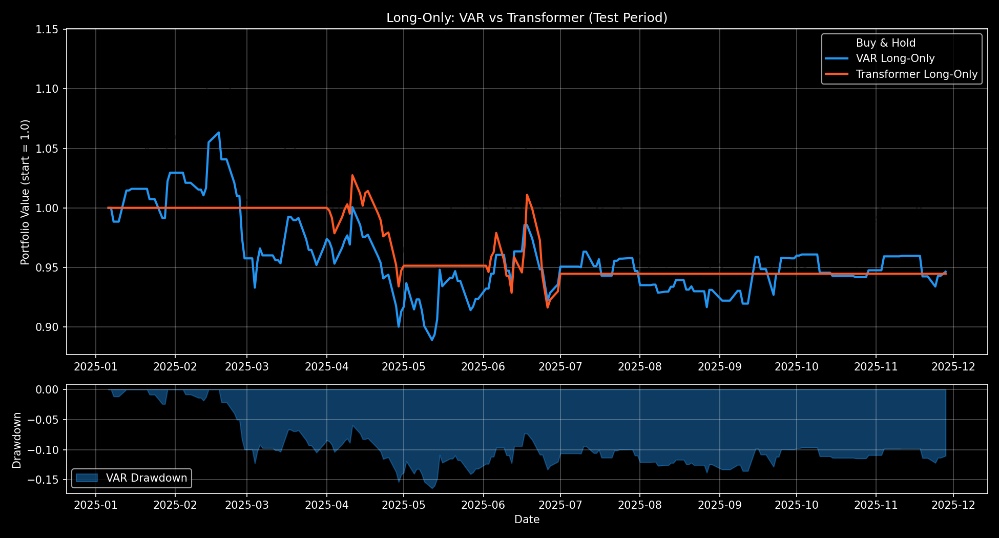
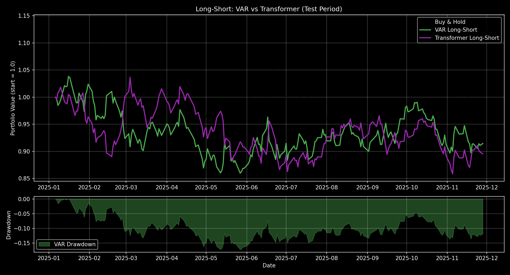
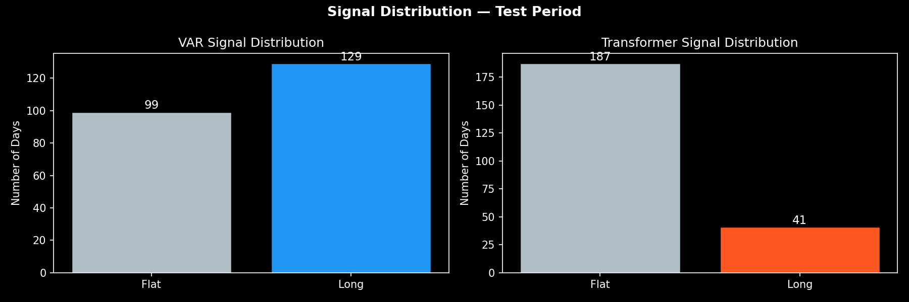
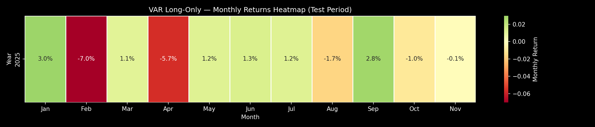

# ML-Driven Portfolio Management for Agricultural Commodity Markets

**NYU GY 5000 — Vertically Integrated Projects (VIP)**  
Predicting wheat futures price direction using machine learning and time-series models, then backtesting systematic trading strategies against real market data.

---

## Overview

This project applies four forecasting models — Decision Tree, VAR, GRU, and Transformer — to predict next-day price direction for wheat futures (ZW=F). Predictions feed into two live-backtested trading strategies benchmarked against buy-and-hold. The full pipeline covers data wrangling, feature engineering, model training, and strategy evaluation with standard financial performance metrics.

**Data**: FRED-MD macroeconomic vintages (31 variables, 1999–2026) combined with 30 lags of daily wheat futures prices — aligned with a one-month reporting delay to prevent look-ahead bias.

**Target**: Binary classification — will the next day's closing price be higher (`Up = 1`) or lower (`Down = 0`)?

---

## Results

### Model Performance (Test Set: Dec 2024 – Jan 2026)

| Model | Accuracy | ROC-AUC | Notes |
|---|---|---|---|
| Decision Tree | 50.0% | 0.512 | Baseline — effectively random |
| **VAR(3)** | **53.1%** | **0.544** | Best overall; interest rate + credit spread inputs |
| GRU | 56.1% | 0.515 | High raw accuracy but class-collapsed on test set |
| Transformer | 55.3% | 0.532 | Encoder-only; class collapse due to training imbalance |

The VAR model achieved the most reliable signal, using four economically motivated macro variables: FEDFUNDS, GS10, BAA, and TB3MS — all directly linked to commodity financing costs and demand conditions.

### Trading Strategy Backtests

| Strategy | Signal Source | vs. Buy & Hold |
|---|---|---|
| Long-Only Momentum | VAR + Transformer | Equity curve below; reduced drawdown |
| Long-Short | VAR + Transformer | Full market exposure in both directions |

#### Long-Only Strategy


#### Long-Short Strategy


#### Signal Distribution — Long-Only


#### Monthly Returns Heatmap — VAR Long-Only


---

## Repository Structure

```
├── backtest.py                       # Custom backtester (numpy/pandas only)
├── generate_notebooks.py             # Programmatically generates strategy notebooks
├── requirements.txt
│
├── notebooks/
│   ├── models/
│   │   ├── decision_tree_v1.ipynb    # Iteration 1
│   │   ├── decision_tree_v2.ipynb    # Final
│   │   ├── var_v1.ipynb
│   │   ├── var_v2.ipynb
│   │   ├── gru_v1.ipynb
│   │   ├── gru_v2.ipynb
│   │   ├── transformer_v1.ipynb
│   │   └── transformer_v2.ipynb
│   └── strategies/
│       ├── strategy_1_long_only.ipynb
│       └── strategy_2_long_short.ipynb
│
├── models/
│   └── transformer_wheat_model.pt    # Saved Transformer weights
│
├── data/
│   ├── wheat_futures.csv             # US wheat futures (ZW=F) closing prices
│   └── fred_md_2026_01.csv          # FRED-MD vintage Jan 2026 (test period)
│   # Historical FRED-MD vintages: see Data section below
│
├── plots/                            # Generated backtest visualizations
└── report/
    └── VIP_Final_Report_Mathew_Martin.pdf
```

---

## Methodology

### Data Pipeline

1. **FRED-MD Vintages**: Three vintage files cover the full timeline (train/val/test). T-code transformations are applied per the FRED-MD specification (log-differencing for most series). A one-month reporting delay is enforced — month M's macro values are only available at month M+1 — preventing any look-ahead bias.
2. **Price Features**: 30 lagged daily closing prices (lag_1 through lag_30) appended to the macro feature matrix. Binary target: `1` if `price_t > price_{t-1}`, else `0`.
3. **Splits**: Train (Aug 1999 – Nov 2014) → Val (Dec 2014 – Nov 2024) → Test (Dec 2024 – Jan 2026). `StandardScaler` fit on train only.

### Models

**Decision Tree** — Baseline CART classifier with depth tuning. Establishes that the task is genuinely hard (near-random test performance).

**VAR(3)** — Vector Autoregression implemented from scratch with numpy OLS (no statsmodels). Endogenous variables: wheat price + FEDFUNDS, GS10, BAA, TB3MS. Lag order p=3 selected by AIC in the development notebook. 1-step-ahead price forecast compared to current price to generate a directional signal.

**GRU** — Gated Recurrent Unit trained on rolling 20-day sequences of the 61-feature matrix. Binary cross-entropy loss. Achieves the highest raw test accuracy but exhibits class collapse on the test set (predicts mostly Down), limiting trading utility.

**Transformer** — Encoder-only Transformer (`seq_len=20, d_model=64, nhead=4, num_layers=2, dim_feedforward=128`). Positional embeddings; last-token representation fed to a sigmoid classification head. Similarly affected by class imbalance during training.

### Trading Strategies

**Strategy 1 — Long-Only Momentum**: Go long (`+1`) on predicted Up days; hold cash (`0`) on predicted Down days. Grounded in Jegadeesh & Titman (1993) and Moskowitz, Ooi & Pedersen (2012).

**Strategy 2 — Long-Short**: Go long (`+1`) on predicted Up, short (`−1`) on predicted Down. Always fully invested. Amplifies signal quality — and noise — in both directions.

Both strategies compare VAR and Transformer signals side by side. The backtester applies a 1-day signal lag (signal on day t drives return on day t+1) to enforce realistic execution.

### Backtester (`backtest.py`)

Custom lightweight implementation using only numpy and pandas. Computes:
- Cumulative and annualized return
- Sharpe ratio (252-day annualization)
- Maximum drawdown
- Number of trades and win rate

---

## Tech Stack

| Category | Libraries |
|---|---|
| Data | `pandas`, `numpy`, `yfinance` |
| ML / DL | `scikit-learn`, `PyTorch` |
| Visualization | `matplotlib`, `seaborn` |
| Notebooks | `jupyter`, `nbformat` |

---

## Data Sources

### Wheat Futures
Downloaded via `yfinance` (ticker: `ZW=F`). The `data/wheat_futures.csv` file covers Aug 1999 – Jan 2026.

### FRED-MD Macroeconomic Data
The two large historical vintage folders (~284 MB combined) are excluded from this repository. Download them from the [FRED-MD page](https://research.stlouisfed.org/econ/mccracken/fred-databases/) and place them at:

```
models/Historical FRED-MD Vintages Final/          # vintages through 2014-12
models/Historical-vintages-of-FRED-MD-2015-01-to-2024-12/   # vintages 2015-01 to 2024-12
```

The Jan 2026 vintage (`data/fred_md_2026_01.csv`) covering the test period is included in this repo.

---

## Setup & Usage

```bash
# Install dependencies
pip install -r requirements.txt

# Run strategy notebooks (after placing FRED-MD data)
jupyter notebook notebooks/strategies/strategy_1_long_only.ipynb
jupyter notebook notebooks/strategies/strategy_2_long_short.ipynb
```

---

## References

- Jegadeesh, N. & Titman, S. (1993). Returns to Buying Winners and Selling Losers. *Journal of Finance*, 48(1), 65–91.
- Moskowitz, T., Ooi, Y. H. & Pedersen, L. H. (2012). Time Series Momentum. *Journal of Financial Economics*, 104(2), 228–250.
- McCracken, M. W. & Ng, S. (2016). FRED-MD: A Monthly Database for Macroeconomic Research. *Journal of Business & Economic Statistics*, 34(4), 574–589.
- Asness, C., Frazzini, A. & Pedersen, L. H. (2012). Leverage Aversion and Risk Parity. *Financial Analysts Journal*, 68(1), 47–59.

---

## License

MIT License — see [LICENSE](LICENSE).
